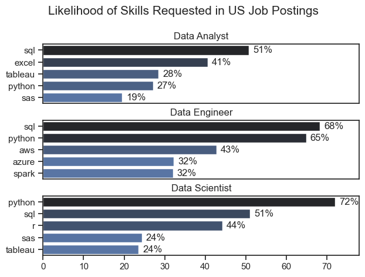
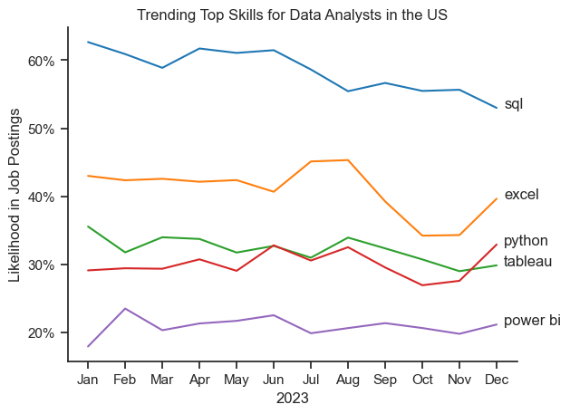
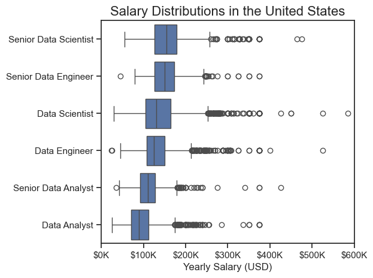
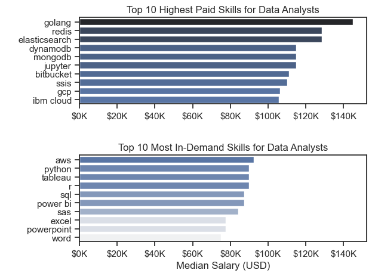
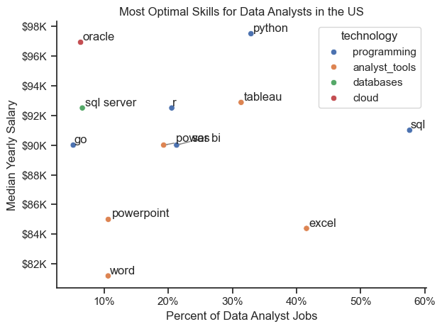

# The Analysis


## 1. What are the most demanded skills for the top 3 most popular data roles?

To find the most demanded skills for the top 3 most popular data roles. I filtered out thise positions by which ones were the most popular, and got the top 5 skills for these top 3 roles. This query highlights the most popular job titles and their top skills, showing which skills i should pay attention to depending on the role I'm targeting.

View  my notebook with detailed steps here:
[Project.ipynb](Project.ipynb)

### Visualize Data

```python
fig, ax = plt.subplots(len(job_titles), 1)

sns.set_theme(style='ticks')

for i, job_title in enumerate(job_titles):
  df_plot = df_skills_perc[df_skills_perc['job_title_short'] == job_title].head(5)
  #df_plot.plot(kind='barh', x='job_skills', y='skill_percent', ax=ax[i], title=job_title)
  sns.barplot(data=df_plot, x='skill_percent', y='job_skills', ax=ax[i], hue='skill_count', palette='dark:b_r')
  ax[i].set_title(job_title)
  ax[i].set_ylabel('')
  ax[i].set_xlabel('')
  ax[i].get_legend().remove()
  ax[i].set_xlim(0, 78)
   
  for n, v in enumerate(df_plot['skill_percent']):
    ax[i].text(v + 1, n, f'{v:.0f}%', va='center')
    
  if i != len(job_titles) - 1:
    ax[i].set_xticks([])
  
fig.suptitle('Likelihood of Skills Requested in US Job Postings', fontsize=15)
fig.tight_layout(h_pad=0.5)
plt.show()
```

### Results


### Insights

- Python is a versatile skill, highly demande across all three roles, but most prominently for Data Scientist (72%) and Data Engineers (65%).

- SQL is the most requested skill for Data Analysts and Data Scientists, with it in over half the job postings for both roles. For Data Engineers, Python is the most sought-after skill, appearing in 68% of job postings.

- Data Engineers require more specialized technical skills (AWS, Spark) compared to Data Analysts and Data Scientists who are expected to be proficient in more general data management and analysis tools (Excel, Tableau).

# The Analysis
## 2. How are in-demand skills trending for Data Analysts? 

### Visualize Data

```python

from matplotlib.ticker import PercentFormatter

df_plot = df_DA_US_percent.iloc[:, :5]
sns.lineplot(data=df_plot, dashes=False, legend='full', palette='tab10')

plt.gca().yaxis.set_major_formatter(PercentFormatter(decimals=0))

plt.show()

``` 

### Results


*Bar graph visualizing the trending top skills for data analysts in the US in 2023.*

### Insights:
- SQL remains the most consistently demande skill throughout the year, although it shows a gradual decrease in demand.
- Excel experienced a significant increase in demand starting around September, surpassing both Python and Tableau by the end of the year.
- Both Python and Tableau show relatively stable demand throughout the year with some fluctuations but remain essential skills for data analysts. Power BI, while less demanded compared to the others, shows a slight upward trend towards the year's end.


# The Analysis

## 3. How well do jobs and skills pay for Data Analysts?

#### Visualize Data

```python
sns.boxplot(data=df_US_top6, x='salary_year_avg', y='job_title_short', order=job_order)

ticks_x = plt.FuncFormatter(lambda x, pos: f'${int(x/1000)}K')
plt.gca().xaxis.set_major_formatter(ticks_x)
plt.show()

``` 

#### Results

*Box plot visualizing the salary distributions for the top 6 data job titles.*

### Insights
- Senior Data Engineer and Senior Data Scientist roles show a considerable number of ouliers on the higher end of the salary spectrum, suggesting that exceptional skills or circumstsances can lead to high pay in these roles. In contrast, Dataa Analysts demonstrate more consistency in salary, with fewer outliers.

- The median salaries increase wuth the seniority and specialization of the roles , Senior roles(Senior Data Scientist, Senior Data Engineer) not only have higher median salaries but also larger differences in typical
salaries, reflecting greater variance in compensation as responsibilities increase.

# The Analysis

## 3. How well do jobs and skills pay for Data 
### Highest Paid & Most Demanded Skills for Data

#### Visualize Data

```python

fig, ax = plt.subplots(2, 1)

#Top 10 Highest Paid Skills for Data Analysts
sns.barplot(data=df_DA_US_top_pay, x='median', y=df_DA_US_top_pay.index, hue='median', ax=ax[0], palette='dark:b_r')

# Top 10 Most In-Demand Skills for Data Analysts
sns.barplot(data=df_DA_skills, x='median', y=df_DA_skills.index, hue='median', ax=ax[1], palette='light:b')

plt.show()

```

#### Results
Here's the breakdown of the highest-paid and most demanded skills for data analysts in the US:


*Two separate bar graphs visualizing the highest paid skills and most in-demand skills for data analysts in the US.*

#### Insights:
- The top graph shows specialized technical skillls like 'golang', 'redis' and 'elasticsearch' are associated with higher salaries, some reaching up to $200k, suggesting that advanced technical proficiency can increase earning potential.

- The bottom graph highlights that foundational skills like 'aws', 'python' and  'tableau' are the most in-demand, even though they may not offer the highest salaries. This demonstrates the importance of these core skills for employability in data analysis roles.

- There's a clear distinction between the skills that are highest paid and those that are most in-demand. Data analysts aimig to maximize their career potential should consider developing a diverse skill set that includes both high-payiong specialized skills and widely demanded foundational skills.


# The Analysis

## 4. What is the most optimal skill to learn for Data Analysts?

#### Visualize Data

```python
from adjustText import adjust_text
from matplotlib.pyplot as plt

plt.scatter(df_DA_skills_high_demand['skill_percent], df_DA_skills_high_demand['median_salary'])
plt.show()

```

#### Results 

  *A scatter plot visualizing the most optimal skills (high paying & high demand) for data analysts in the US.*
  
#### Insights
- The scatter plot shows that most of the 'programming' skills (colored blue) tend to cluster at higher salary levels compared to other categories, indicating that programming expertise might offer greater salary benefits within the  data analystics field.

- Analyst tools (colored orange), including Tableau and Power BI, are prevalent in Job postings and offer competitive salaries, showing that vaisualization and data analysts software are crucial for current data roles. This category not only has good salaries but is also versatile acreoss different types of data tasks.


### Conclusion

This exploration into the data analyst job market has been incredibly informative, highlighting the critical skills and trends that shape this evolving field. The insighst i got enhance ny understanding and provide actionable guidance fpor anyone looking to advance their career in data analysts. This project is a good foundation for future explorations and underscores the importance of continuous learning and adaptation in the data field.